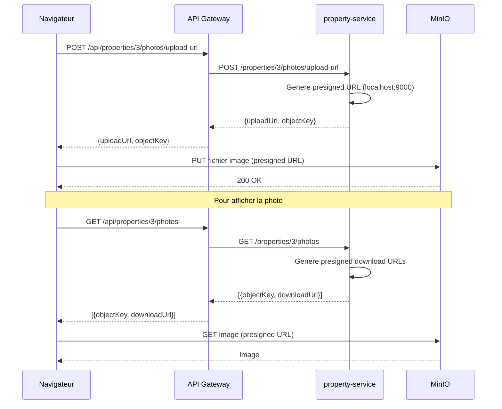

```mermaid
sequenceDiagram
    participant B as Navigateur
    participant GW as API Gateway
    participant PS as property-service
    participant M as MinIO

    B->>GW: POST /api/properties/3/photos/upload-url
    GW->>PS: POST /properties/3/photos/upload-url
    PS->>PS: Genere presigned URL (localhost:9000)
    PS-->>GW: {uploadUrl, objectKey}
    GW-->>B: {uploadUrl, objectKey}
    B->>M: PUT fichier image (presigned URL)
    M-->>B: 200 OK

    Note over B,M: Pour afficher la photo
    B->>GW: GET /api/properties/3/photos
    GW->>PS: GET /properties/3/photos
    PS->>PS: Genere presigned download URLs
    PS-->>GW: [{objectKey, downloadUrl}]
    GW-->>B: [{objectKey, downloadUrl}]
    B->>M: GET image (presigned URL)
    M-->>B: Image
```
